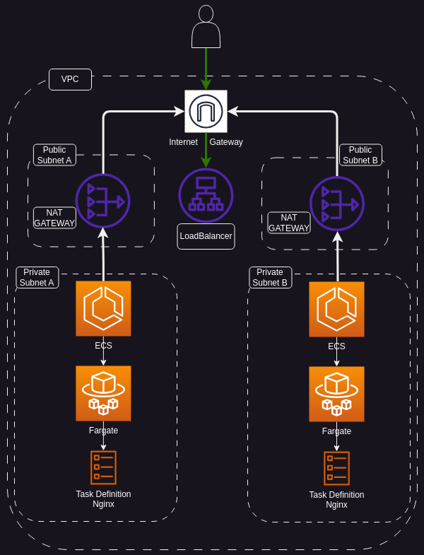

# Terraform CDK for AWS ECS Fargate

## Table of Contents

- [Introduction](#introduction)
- [AWS ECS Fargate](#aws-ecs-fargate)
- [Project Structure](#project-structure)
- [Getting Started](#getting-started)
- [Contributing](#contributing)
- [License](#license)

## Introduction

Welcome to the Terraform CDK project for AWS ECS Fargate! This project leverages the power of Terraform and the ease of the CDK (Cloud Development Kit) to create and manage AWS infrastructure for running containerized applications using ECS Fargate. In this README, we'll provide an overview of Terraform and the CDK, explain the benefits of using them together, and describe how Terraform CDK works.

### What is Terraform?

[Terraform](https://www.terraform.io/) is an open-source infrastructure as code (IaC) tool that enables you to define and provision your infrastructure using a declarative configuration language. Terraform helps you manage your infrastructure efficiently by creating, updating, and destroying resources as needed, while also providing a clear and versioned representation of your infrastructure.

### What is Terraform CDK?

The Terraform CDK (CDKTF) is a framework that allows you to define infrastructure using familiar programming languages like TypeScript, Python, and Go. This enables developers to harness the power of Terraform while leveraging the expressiveness and abstraction capabilities of their chosen programming language. CDKTF provides a higher-level way to define and manage infrastructure resources, making it easier to create and maintain complex infrastructure setups.

### Benefits of Terraform CDK

- **Expressiveness**: Write infrastructure code using programming languages you are familiar with, enabling you to use loops, conditionals, and other language features.

- **Abstraction**: Create reusable constructs and abstractions to simplify your infrastructure definitions and reduce boilerplate code.

- **IDE Support**: Leverage the capabilities of modern code editors and IDEs for autocompletion, error checking, and debugging.

- **Terraform Compatibility**: CDKTF generates Terraform configuration, so you can seamlessly integrate with existing Terraform projects and modules.

### How Terraform CDK Works

Terraform CDK operates in two main steps:

1. **Generate Terraform Configuration**: Your CDK code is used to generate Terraform configuration files (`.tf.json`) that represent the desired infrastructure.

2. **Apply with Terraform**: Terraform then takes these generated configuration files and applies them to create or modify AWS resources based on your specifications.

## AWS ECS Fargate

[AWS Elastic Container Service (ECS) Fargate](https://aws.amazon.com/ecs/) is a compute engine for containers that allows you to run Docker containers without managing the underlying infrastructure. It's a serverless option for deploying and managing containerized applications, offering high scalability and ease of use.

## Project Structure

Here's an overview of the project structure:

<p align="center">
  
</p>

## Getting Started

To use this project, you'll need the following prerequisites:

- [Terraform](https://www.terraform.io/) installed on your local machine and connect to your terraform cloud account.
- [Terraform Project]() Created a terraform project in your terraform cloud account.
- [CDKTF (Terraform CDK)](https://cdk.tf/) installed on your local machine.
- [GoLang](https://golang.org/) version 1.20 or higher installed.

Follow these steps to get started:

1. Clone the repository:

   ```sh
   git clone git@github.com:ralvescosta/cdktf-hello-world.git
   cd cdktf-hello-world
   ```
2. Update the [configure package](./pkg/configs/configs.go) with your terraform cloud configurations.

3. Get the pre built AWS go files

```sh
cdktf get
```

4. Run cdktf plan to check if everything is configured

```sh
cdktf plan
```

5. With everything set up, just deploy

```sh
cdktf deploy
```

That's it! You've successfully deployed your AWS ECS Fargate infrastructure using Terraform CDK.

## Contributing

We welcome contributions from the community! If you'd like to contribute to this project, please read our Contributing Guidelines to get started.

## License

This project is licensed under the MIT License. See the [LICENSE](./LICENSE) file for more details.
